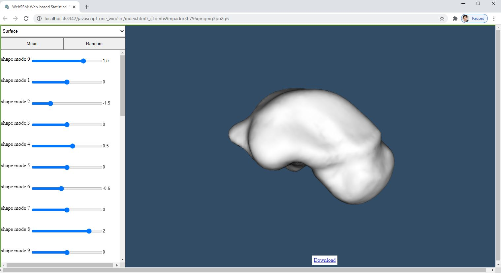
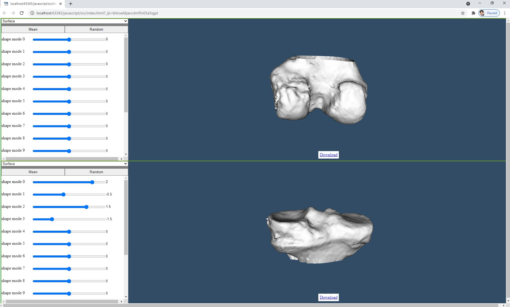
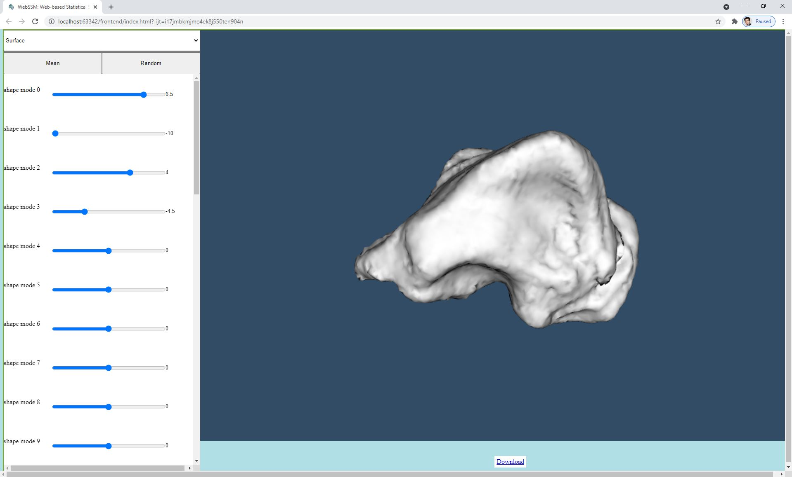

# WebSSM

a web-based tool for visualizing, manipulating and sampling statistical shape models in [scalismo](https://github.com/unibas-gravis/scalismo)

## Motivation
[scalismo](https://scalismo.org/) is a library for statistical shape modelling and model-based image analysis in Scala.
WebSSM aims to bringing these statistical shape models to the convenience of web. So anyone accessing the web can view and interact with your shape model, also create samples and download them for their use.

## Demo
- you can see a video demo of how WebSSM looks in [here](https://www.youtube.com/watch?v=7YUsT4kE_Zg).
- an online demo is available in [here](https://ankleshapemodels.com/)
- page on image sciences institute website [ISI@UU](https://www.isi.uu.nl/research/software/webssm/)

## Screenshots

## Tech/Framework used
- Python
	- Flask
- Scala
	- Scalismo
- Javascript
	- Node.js
	- VTK.js
	
## How to use
you can fork the project (click fork in top right of this page), then you can start working on the project from your GitHub account. Then clone the code to your local machine.

### step1. start by making your shape model ready for web
#### quick
Having sbt installed, place your statistical shape model file (.h5 extension) in `data` folder of `data-preparation` directory, then open a terminal and run `sbt run`. it will extract all required parameters from your shape model and writes them in 4 .csv files in the results folder.
#### advanced
Follow the [tutorial](https://scalismo.org/docs/ide) in Scalismo website, you'll be able to open the `data-preparatio` folder as a project in IntellijIdea IDE, make any change you like in the code and build it. It's especially useful for some cases that your shape model is too big for the lightweight web view, then you can change the code a bit to sample from the shape model.

### step2. continue with the backend
Within `backend` directory, place .csv file generated in step 1, into the folder `data`. In the `backend` folder open a terminal and do following tasks:
run the following commands in cmd or powershell, while in `backend` folder:
`python -m venv venv` //creates a virtual environment in which requirements will be installed
`./venv/Scripts/activate.bat` //(if you're using powershell, change .bat to .ps1)
`pip install -r requirements.txt` //installs requirement in the virtual environment

`$env:FLASK_APP = "app.py"`
`flask run`

### step3. finish with frontend
Now if you just open the `index.html` file from the `frontend` directory, into your browser, you should see the your shape model as you expect.
#### advanced
having Node.js installed, open a terminal in the `frontend` folder and run `npm install`. it will generate a folder called node_modules and installs everything you need to build the project.
In case you wanted to make changes in the frontend (like changing menus, adding functionalities, ...) you can make your changes basically in `src/webssm.js` file and then build the project with command `npx webpack --progress`

### deployment on server
enjoying viewing your shape model in your browser? if you want to deploy your web-based tool to your real server, you have a few more steps to do. Then if you send me a message in email (gsarbabi@gmail.com) or in [Scalismo google discussion group](https://groups.google.com/g/scalismo), I'll provide you with an step-by-step guide.

### your contribution
a lot of rooms for improvement and other ideas can be implemented in the code with pretty much little changes, a few shown bellow:
#### multiple view
for instance in case you're visualizing like a joint, there's possiblity to show them in the same page. an example is bellow: 

#### tuning the MoVs to more than 3SD of mean shape
here you see an example of the shape, you can change the MoVs to something far to 10 SD in this example:

